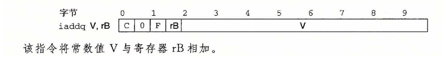

<center><font size = 7>Some Notes</font></center>
<p align = 'right'><font size = 3>by Nemo</font></p>
<p align = 'right'><font size = 3>2024.1.10</font></p>

# start
安装`bison`和`flex`，以及`tk`和`tcl`库。
```shell
sudo apt install bison flex
sudo apt-get install tk tk-dev tcl tcl-dev
```

# part A
将`misc/examples.c`中的三个函数使用y86汇编实现（命名为`.ys`文件）  
我选择在`y86-code`实现这三个`.ys`文件，然后`make <file>.ys`生成对应的`.yo`文件，再使用`../misc/yis <file>.yo`运行。检查`%rax`的值即可判断是否正确。

# part B
iaddq指令：  

根据`simguide.pdf`中的cpu执行流程图修改`seq/seq-full.hcl`，添加`iaddq`指令。修改一下scrB，rB等等的选择即可。

```shell
make VERSION=full
```
- 如果出现报错`找不到tk.h头文件`，可能需要修改`seq/Makefile`中的`TKINC`，改为你安装tcl库的位置。  
- 如果出现报错`error: ‘Tcl_Interp’ {aka ‘struct Tcl_Interp’} has no member named ‘result’`，可以参考[这里](https://stackoverflow.com/questions/66291922/tk-h-looks-for-tcl-h-in-usr-include-but-tcl-h-is-in-usr-include-tcl-i-dont-h)
- 如果出现报错`matherr未定义`，在`seq/ssim.c`中找到`matherr`所在的两行注释掉即可

然后按照`archlab.pdf`中的步骤操作即可

# part C
目的是尽可能减少`ncopy.ys`程序的CPE（即`cycle per element`，就是对每一个元素需要花费的周期数）  

## step 1
根据提示，修改`pipe/pipe-full.hcl`，使其支持`iaddq`指令。这样寄存器加上一个立即数就不需要`irmovq`和`addq`两步指令。  
同样，如果出现了同part B一样的报错，可以参考同样的解决方法。  
操作步骤同part B，之后`cd ../ptest; make SIM=../pipe/psim TFLAGS=-i`检查正确性。

## step 2
重写`ncopy.ys`。有几个优化的点：
- 将`irmovq`和`addq`替换为`iaddq`，减少了一条指令
- 循环展开。可以参考教材的`Section 5.8`，可以减少条件判断的次数。我使用了8-4-2-1的嵌套循环展开，即每次循环处理8个元素，然后4个，然后2个，最后1个。
- 戳气泡。由于流水线方法是支持转发（`forward`）的，所以只需考虑`rmmovq`这种到`memory`阶段才能获取到寄存器的值的指令，确保其后面的指令不会使用到这个寄存器即可，不然会出现bubble。可以通过合理调整指令的顺序来优化。
- 条件预测。流水线总是预测分支为真，所以我再8循环展开的时候，使用`jg`+`jmp`的方式来代替`jle`，这样就可以减少分支预测错误的情况。而在4-2-1循环展开的时候，因为最多预测错误一次，所以使用`jle`即可。
- 条件判断的时候，由于使用`iaddq`也可以设置条件码，所以在n循环展开的时候，可以使用`iaddq $-n, %rdx`，然后使用`jl`来代替`jle`，`jge`代替`jg`来判断时候结束循环，这样同时完成了减少`%rdx`的操作。

目前优化到`40/60`，`CPE`为`8.5`。接下来可行的优化方向，我认为有：
- `CPE`较大的地方主要是前面几项，可以适当减少嵌套循环展开的层数，或者使用其他循环展开的次数，比如7循环展开，6循环展开。我感觉这个过于刻意了，所以没做下去了。
- 可以扩充指令集。

<p align = 'right'><font size = 3>by Nemo</font></p>
<p align = 'right'><font size = 3>2024.1.13</font></p>